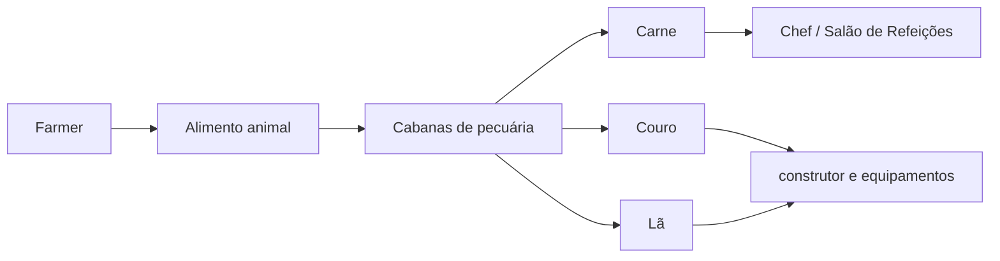

# Pecuária da colônia

| Animal | Entrada | Produtos |
|---|---|---|
| Vaca | Trigo | Carne, couro e leite |
| Ovelha | Trigo | Lã e carne |
| Porco | Alimento compatível | Carne |

## Implantação

1. Construa a cabana perto da produção de alimento.
2. Leve dois animais.
3. Ative reprodução e alimentação.
4. Defina estoque mínimo das ferramentas.
5. Conecte os produtos ao Armazém.
6. Desative reprodução quando a demanda estiver atendida.

## Cadeia

## Fontes

- [Cowhand’s Hut — Wiki oficial](https://minecolonies.com/wiki/buildings/cowboy/)
- [Shepherd’s Hut — Wiki oficial](https://minecolonies.com/wiki/buildings/shepherd/)
- [Swineherd’s Hut — Wiki oficial](https://minecolonies.com/wiki/buildings/swineherder/)
