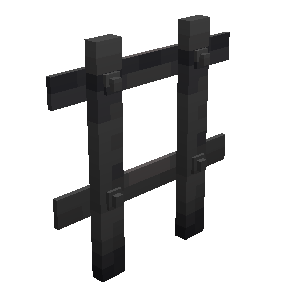

# Galeria de Itens

Esta galeria reúne referências visuais de itens por função, mantendo ferramentas, equipamentos, alimentos, recursos, pergaminhos e blocos em grupos separados.

## Blocos funcionais

| Portão de Madeira | Portão de Ferro |
|---|---|
|  |  |

As páginas individuais mostram a colocação, o estado fechado e o estado aberto de cada portão.

## Categorias

| Categoria | Exemplos de uso | O que caracteriza uma variante |
|---|---|---|
| Ferramentas | Ferramentas de trabalho e ferramenta de construção (*Build Tool*) | Modelo ou função visualmente distinta |
| Equipamentos | Armas, armaduras e escudos | Tipo de equipamento, não durabilidade |
| Alimentos | Ingredientes e refeições | Receita ou item diferente, não quantidade |
| Recursos | Materiais das cadeias produtivas | Estado processado ou material distinto |
| Pergaminhos | Pergaminhos e itens de missão | Tipo ou destino diferente |
| Blocos | Portões e outros blocos funcionais do mod | Aparência ou função diferente |

Os arquivos devem seguir [[assets/itens/README|Imagens de itens]]. A relação funcional entre os itens permanece no [[content/00 - Índices/Índice de Recursos|Índice de Recursos]].
