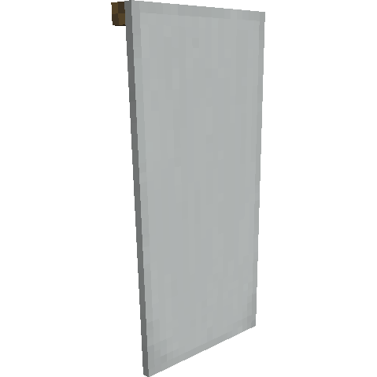
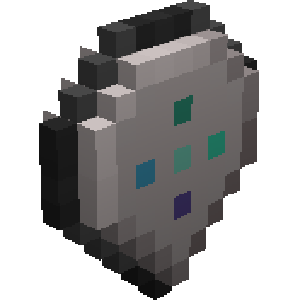
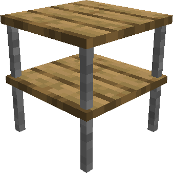
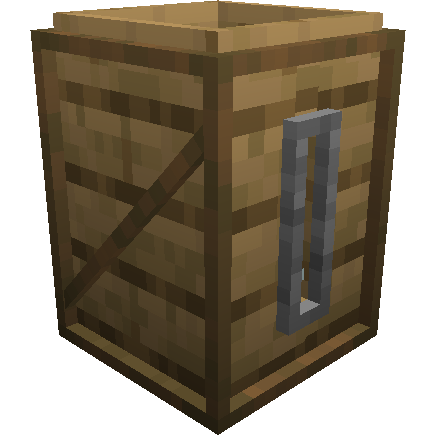
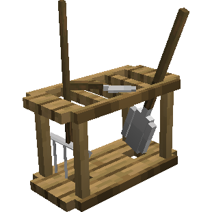
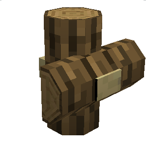
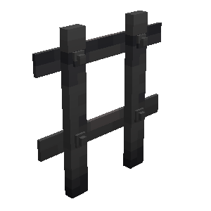

# Galeria de Itens

Esta galeria reúne referências visuais de itens por função, mantendo ferramentas, equipamentos, alimentos, recursos, pergaminhos e blocos em grupos separados.

## Blocos funcionais

As páginas canônicas registram receita ou forma de obtenção, uso, relações com construções e profissões, imagens disponíveis e fontes. Clique no ícone para abrir a página do item.

### Colônia e esquemas

| Estandarte da Colônia | Fita de Construção |
|---|---|
|  |  |

| Ponto de Passagem | Controlador de Decoração |
|---|---|
|  |  |

### Logística e armazenamento

| Caixa de Pedidos | Caixa de Depósito |
|---|---|
|  |  |

| Estante |  |
|---|---|
|  |  |

### Agricultura

| Barril de Compostagem | Campo |
|---|---|
|  |  |

| Campo da Plantação |  |
|---|---|
|  |  |

### Acesso e defesa

| Portão de Madeira | Portão de Ferro |
|---|---|
|  |  |

As páginas dos portões também mostram a colocação e os estados fechado e aberto.

## Categorias

| Categoria | Exemplos de uso | O que caracteriza uma variante |
|---|---|---|
| Ferramentas | Ferramentas de trabalho e ferramenta de construção (*Build Tool*) | Modelo ou função visualmente distinta |
| Equipamentos | Armas, armaduras e escudos | Tipo de equipamento, não durabilidade |
| Alimentos | Ingredientes e refeições | Receita ou item diferente, não quantidade |
| Recursos | Materiais das cadeias produtivas | Estado processado ou material distinto |
| Pergaminhos | Pergaminhos e itens de missão | Tipo ou destino diferente |
| Blocos | Controle, logística, agricultura e defesa | Identidade funcional distinta |

Os arquivos devem seguir [[assets/itens/README|Imagens de itens]]. A relação funcional entre os itens permanece no [[content/00 - Índices/Índice de Recursos|Índice de Recursos]].
