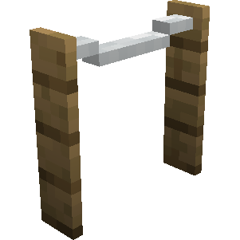

# Construction Tape — Fita de Construção

## Visão geral

A Fita de Construção marca o perímetro das ordens de construção, melhoria, reparo e reposicionamento. O MineColonies pode gerá-la automaticamente um bloco além da área ocupada pelo esquema.

## Como produzir

| Materiais | Disposição na bancada | Resultado |
|---|---|---|
| 6 gravetos e 1 lã | gravetos nas laterais das três linhas; lã no centro superior | 1 Fita de Construção |

## Como usar

- a fita não é sólida e pode ser atravessada;
- sua orientação muda conforme a direção da colocação;
- para sinalização automática, confira a opção **Construction tape** nas [[content/02 - Administração/Configurações da colônia|Configurações da colônia]];
- também pode ser colocada manualmente como decoração.

## Relações

- [[content/01 - Primeiros Passos/Build Tool]]
- [[content/04 - Profissões/Builder - Construtor]]
- [[content/03 - Construções/Produção/Builder's Hut - Cabana do Construtor]]

## Fontes

- [Construction Tape — Wiki oficial](https://minecolonies.com/wiki/items/construction_tape/)
- [Receita oficial — 1259-snapshot](https://github.com/ldtteam/minecolonies/blob/v1.20.1-1.1.1259-snapshot/src/datagen/generated/minecolonies/data/minecolonies/recipes/blockconstructiontape.json)

