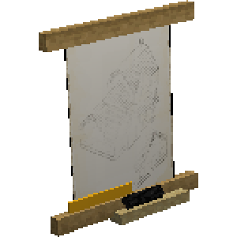
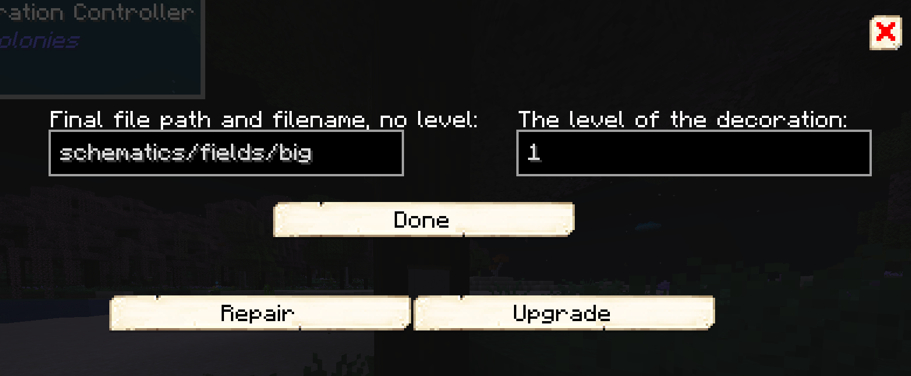

# Decoration Controller — Controlador de Decoração

## Visão geral

O Controlador de Decoração administra decorações e auxilia a criação de esquemas personalizados. Sua interface pode oferecer reparo ou melhoria quando a decoração possui níveis compatíveis.

> [!WARNING] Somente no modo Criativo
> A Wiki oficial informa que este bloco não possui receita e deve ser obtido pelo inventário criativo ou por comando.

## Como usar

1. coloque o bloco junto à decoração ou ao trabalho de criação de esquemas;
2. clique com o botão direito para abrir a interface;
3. use apenas as ações disponíveis para a decoração reconhecida.

## Interface

## Relações

- [[content/01 - Primeiros Passos/Build Tool]]
- [[content/03 - Construções/Produção/Builder's Hut - Cabana do Construtor]]

## Fontes

- [Decoration Controller — Wiki oficial](https://minecolonies.com/wiki/items/decorationcontroller/)
- [MinecoloniesWiki — fonte da interface](https://github.com/ldtteam/MinecoloniesWiki)

