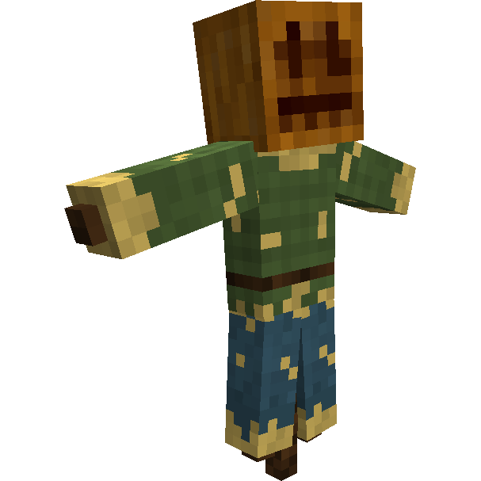

# Field — Campo

## Visão geral

O Campo é o bloco de controle da área cultivada pelo [[content/04 - Profissões/Farmer - Fazendeiro|Fazendeiro]]. Não funciona como uma cabana independente: precisa ser associado a uma [[content/03 - Construções/Alimentação/Farmer's Hut - Cabana do Fazendeiro|Cabana do Fazendeiro]].

## Como produzir

| Materiais | Disposição na bancada | Resultado |
|---|---|---|
| 1 bloco de feno **ou** abóbora, 3 gravetos e 1 couro | feno/abóbora no centro superior; graveto, couro e graveto no meio; graveto no centro inferior | 1 Campo |

## Como usar

- coloque o espantalho na área destinada ao cultivo;
- associe-o a uma Cabana do Fazendeiro;
- selecione a plantação e mantenha sementes, ferramentas e acesso livres;
- consulte a página canônica [[content/03 - Construções/Alimentação/Field - Campo|Field — Campo]] para operação e configurações.

## Fontes

- [Farmer's Hut e Fields — Wiki oficial](https://minecolonies.com/wiki/buildings/farmer/)
- [Receita oficial — 1259-snapshot](https://github.com/ldtteam/minecolonies/blob/v1.20.1-1.1.1259-snapshot/src/datagen/generated/minecolonies/data/minecolonies/recipes/blockhutfield.json)

