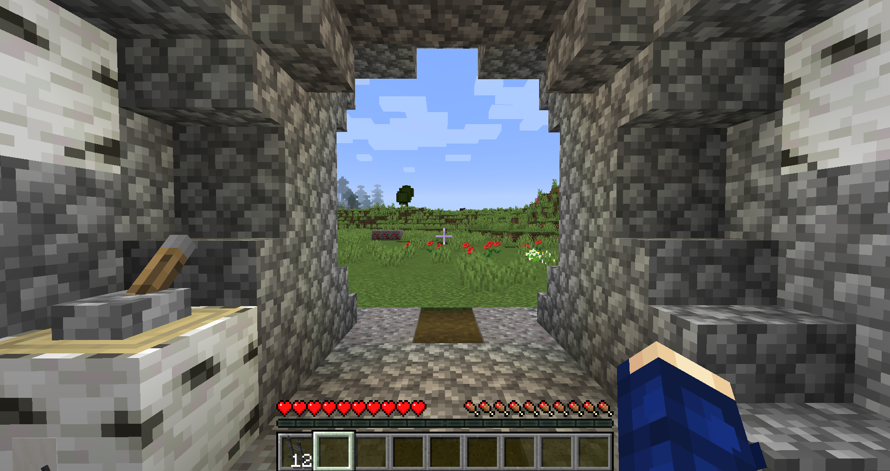
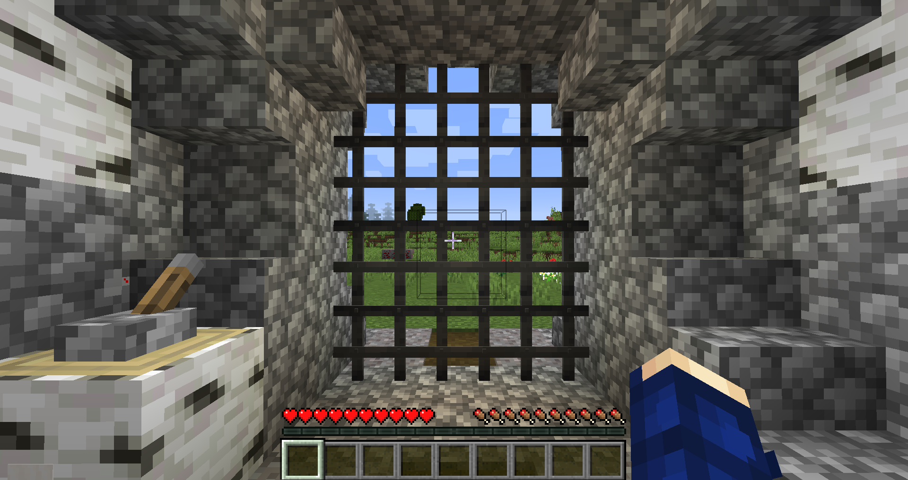
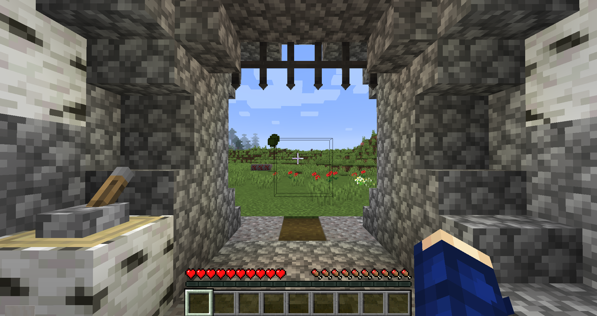

# Iron Gate — Portão de Ferro

## Visão geral

O Portão de Ferro é a variante mais resistente dos portões expansíveis do MineColonies. Ele serve para entradas, muralhas e passagens largas, pode ser usado por jogadores e cidadãos como uma porta comum e também responde a sinais de redstone.

Contra invasores, permanece intacto por mais tempo do que o [[content/09 - Referências/Itens/Wooden Gate - Portão de Madeira|Portão de Madeira]]. Pesquisas da Universidade podem ampliar ainda mais a durabilidade dos portões.

## Como produzir

| Produção da colônia | Materiais | Resultado |
|---|---|---|
| [[content/03 - Construções/Produção/Mechanic's Hut - Oficina do Mecânico|Oficina do Mecânico]] | 5 pepitas de ferro | 1 Portão de Ferro |

O [[content/04 - Profissões/Mechanic - Mecânico|Mecânico]] é o profissional responsável por essa receita na colônia.

## Como colocar e usar

1. Empilhe a quantidade de portões que formará a estrutura.
2. Segure a pilha e clique com o botão direito no ponto de instalação.
3. O jogo coloca a pilha de uma vez e preenche o espaço disponível.
4. Use o botão direito ou um sinal de redstone para abrir e fechar.

O conjunto pode ocupar no máximo **5 blocos de largura por 4 de altura**. Verifique a área livre antes de colocar a pilha.

## Galeria

| Antes de colocar | Fechado | Aberto |
|---|---|---|
|  |  |  |

## Construção e profissionais relacionados

- [[content/03 - Construções/Militar/Gatehouse - Portaria|Gatehouse — Portaria]]: construção militar cujo esquema precisa conter um portão e posições para dois guardas.
- [[content/04 - Profissões/Mechanic - Mecânico|Mecânico]]: produz o item.
- [[content/04 - Profissões/Archer - Arqueiro|Arqueiro]] e [[content/04 - Profissões/Knight - Cavaleiro|Cavaleiro]]: podem trabalhar na Portaria, mas não fabricam o portão.

## Fontes

- [Gates — Wiki oficial do MineColonies](https://minecolonies.com/wiki/items/gates/)
- [Receita oficial do Iron Gate — MineColonies 1259-snapshot](https://github.com/ldtteam/minecolonies/blob/v1.20.1-1.1.1259-snapshot/src/datagen/generated/minecolonies/data/minecolonies/crafterrecipes/mechanic/gate_iron.json)

