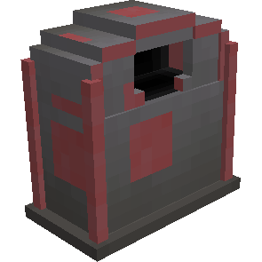
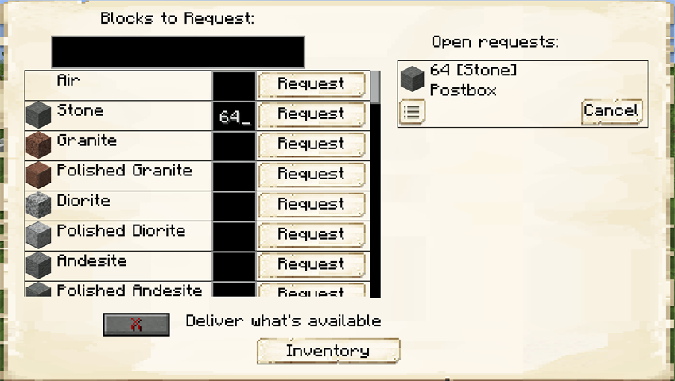

# Postbox — Caixa de Pedidos

## Visão geral

A Caixa de Pedidos permite solicitar itens armazenados ou produzidos pela colônia. Um [[content/03 - Construções/Transporte/Courier's Hut - Cabana do Entregador|Entregador]] busca os recursos e os deposita no inventário do bloco.

## Como produzir

| Materiais | Disposição na bancada | Resultado |
|---|---|---|
| 5 tábuas, 3 baús e 1 [[content/01 - Primeiros Passos/Build Tool|Build Tool]] | tábua, Build Tool e tábua; três baús; três tábuas | 1 Caixa de Pedidos |

## Como usar

1. abra a interface e procure o item;
2. informe a quantidade e confirme a solicitação;
3. acompanhe o pedido na lista à direita;
4. retire os itens depois da entrega.

A opção de entregar o que estiver disponível permite receber uma quantidade parcial quando o Armazém não possui o total pedido.

## Interface

## Relações

- [[content/02 - Administração/Sistema de pedidos]]
- [[content/03 - Construções/Transporte/Warehouse - Armazém]]
- [[content/03 - Construções/Transporte/Courier's Hut - Cabana do Entregador]]

## Fontes

- [Postbox — Wiki oficial](https://minecolonies.com/wiki/items/postbox/)
- [Receita oficial — 1259-snapshot](https://github.com/ldtteam/minecolonies/blob/v1.20.1-1.1.1259-snapshot/src/datagen/generated/minecolonies/data/minecolonies/recipes/blockpostbox.json)

