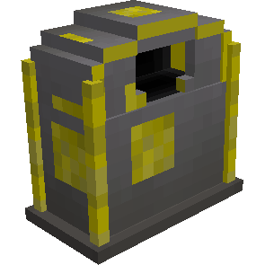

# Stash — Caixa de Depósito

## Visão geral

A Caixa de Depósito faz o caminho inverso da Caixa de Pedidos: recebe itens do jogador para que um Entregador os leve ao Armazém mais próximo.

## Como produzir

| Materiais | Disposição na bancada | Resultado |
|---|---|---|
| 6 tábuas, 2 baús e 1 [[content/01 - Primeiros Passos/Build Tool|Build Tool]] | tábua, Build Tool e tábua; baú, tábua e baú; três tábuas | 1 Caixa de Depósito |

## Como usar

1. coloque a caixa dentro de uma rota atendida pelos Entregadores;
2. abra o inventário e deposite os itens;
3. aguarde a coleta e a transferência ao Armazém.

> [!TIP]
> Use a Caixa de Depósito perto da entrada ou de áreas de descarga para incorporar rapidamente grandes coletas à logística da colônia.

## Relações

- [[content/03 - Construções/Transporte/Warehouse - Armazém]]
- [[content/03 - Construções/Transporte/Courier's Hut - Cabana do Entregador]]
- [[content/06 - Recursos e Produção/Armazém e entregadores]]

## Fontes

- [Stash — Wiki oficial](https://minecolonies.com/wiki/items/stash/)
- [Receita oficial — 1259-snapshot](https://github.com/ldtteam/minecolonies/blob/v1.20.1-1.1.1259-snapshot/src/datagen/generated/minecolonies/data/minecolonies/recipes/blockstash.json)
